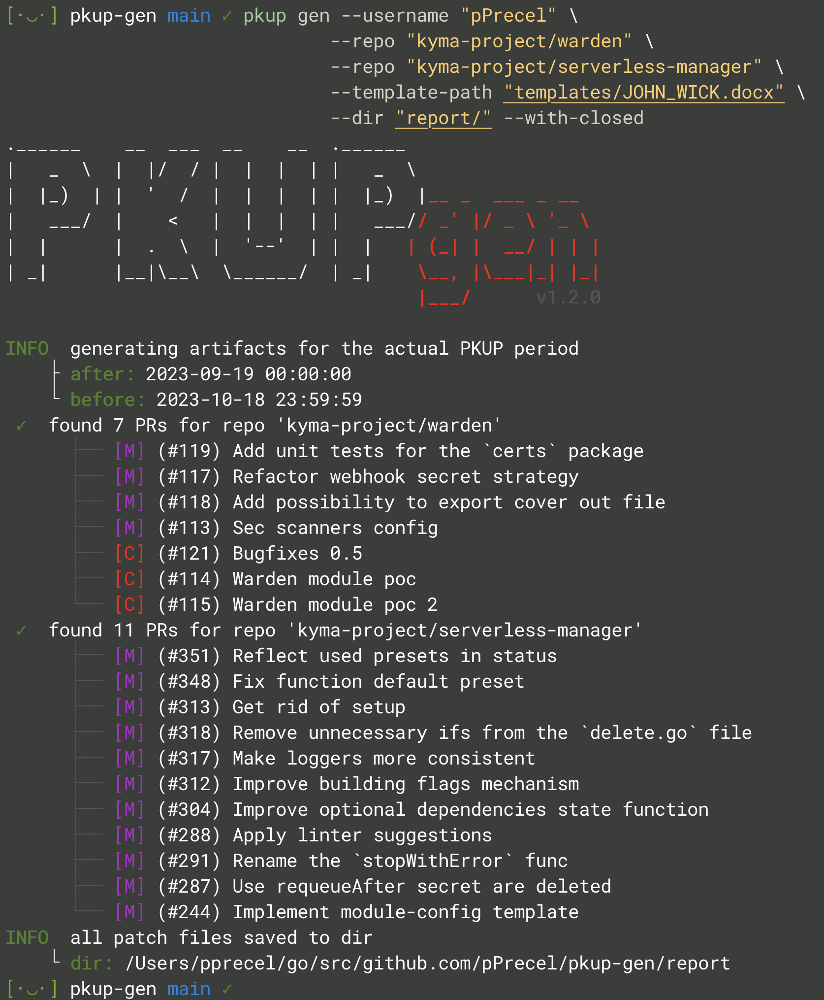

#

``` text
.______    __  ___  __    __  .______
|   _  \  |  |/  / |  |  |  | |   _  \
|  |_)  | |  '  /  |  |  |  | |  |_)  |__ _  ___ _ __
|   ___/  |    <   |  |  |  | |   ___// _' |/ _ \ '_ \
|  |      |  .  \  |  '--'  | |  |   | (_| |  __/ | | |
| _|      |__|\__\  \______/  | _|    \__, |\___|_| |_|
                                      |___/
```

---

[](https://github.com/pPrecel/pkup-gen/blob/main/LICENSE)
[](https://github.com/pPrecel/pkup-gen/actions/workflows/build.yml)
[](https://goreportcard.com/report/github.com/pPrecel/PKUP)

---

Simple and easy-to-use tool to generate PKUP (`Podwyższone Koszty Uzyskania Przychodu` - Polish law thing) report (`.docx`) and artifacts (`.diff`).

The `pkup-gen` collects all users' commits pushed between the 18th (23:59:59) of the actual month and the 19th (00:00:00) of the past one. To qualify a commit, the user should be an author or co-author of it.

## Installation

Visit the [releases page](https://github.com/pPrecel/pkup-gen/releases) to download one of the pre-built binaries for your platform.

### Homebrew

1. Install the `pkup-gen` using the Homebrew:

    ```bash
    brew install pPrecel/tap/pkup-gen
    ```

    or

    ```bash
    brew tap pPrecel/tap
    brew install pkup-gen
    ```

## Usage

Example usage:



For more go to the [examples](https://github.com/pPrecel/pkup-gen/tree/main/examples) dir.

## report

By default, the `pkup-gen` generates the `report.txt` files with all the info needed to fill a true report.

The `.docx` report template can be specified using the `--template` flag. The `pkup-gen` will replace any repeat of the following keywords with the true data:

* `pkupGenPeriodFrom` - date of the first day for the actual period
* `pkupGenPeriodTill` - date of the last day for the actual period
* `pkupGenApprovalDate` - date of the last day of the period plus one day
* `pkupGenResults` - list of all PullRequests if format <PR_TITLE>( DIFF_FILE_NAME )

The `pkup-gen` allows adding a new formula to replace the output `.docx` file. It can be achieved by adding a flag `--report-field` like in the following example:

```bash
--report-field "pkupGenEmployeesName=John Wick"
```

## Access Token

The `pkup-gen` needs credentials to connect with the GitHub API. There are two possible ways to pass such credentials:

* By default, the `pkup-gen` will reach the [pkup-gen](https://github.com/apps/pkup-gen) app using the GitHub device API. The generated token will be saved on the local machine so next time, until the token expires, the user will be logged in. This flow is not working with the `--enterprise-url` flag.

* The `--token` flag allows to pass a [PAT](https://docs.github.com/en/authentication/keeping-your-account-and-data-secure/managing-your-personal-access-tokens). For public projects, the generated token does not need to have any permissions.

## Automation

The `pkup-gen` application supports more complex use cases to generate a report based on several different GitHub instances ( for example opensource and enterprise ) and for many usernames. The app allows one to compose many reports for the same orgs/repos for many people and send emails to them with zipped reports.

For more read [this](./examples/compose-and-send/README.md) article.

## Claude Code Skills

`pkup-gen` ships two [Claude Code](https://claude.ai/code) skills that let you generate and enrich PKUP reports directly from an AI conversation — no CLI flags, no YAML config.

### Installation

```bash
claude plugin marketplace add pPrecel/pkup-gen
claude plugin install pkup-gen@pkup-gen
claude plugin install pkup-enchant@pkup-gen
```

### Skills

**`/pkup-gen`** — generates the report

1. Asks about provider/org configuration and confirms the PKUP period
2. Verifies `gh` CLI login for each provider
3. Queries GitHub for all your commits in the period (handles multiple author signatures)
4. Downloads a `.diff` file per commit into the output directory
5. Suggests running `/pkup-enchant` as the next step

**`/pkup-enchant`** — enriches the report

1. Detects the output directory and fetches PR/issue context from GitHub
2. Groups commits into coherent tasks; proposes which groups to include or skip
3. Lets you review and adjust the classification before proceeding
4. Deletes `.diff` files for excluded groups
5. Writes a one-sentence Polish description per included group (_"Zaprojektowałem oraz zaimplementowałem..."_)
6. Overwrites the report file (`.txt` or `.docx`) with the enriched result

### Combining skills

The skills are designed to work together but can also be used independently. A common hybrid scenario: generate the report with the `pkup-gen` CLI binary (or `pkup compose`), then run `/pkup-enchant` in Claude Code to handle the enrichment step:

```bash
# Step 1 — generate with the CLI
pkup gen --username pPrecel --org kyma-project --output reports/FILIP_STROZIK

# Step 2 — enrich with the skill (in Claude Code)
/pkup-enchant
```

The skill picks up any directory containing `.diff` files produced by either the CLI or the `/pkup-gen` skill.

For a full walkthrough see [examples/claude-skills](./examples/claude-skills/README.md).
