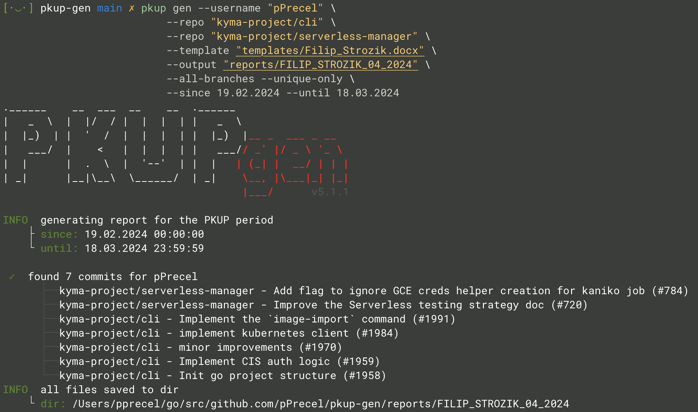

#

``` text
.______    __  ___  __    __  .______
|   _  \  |  |/  / |  |  |  | |   _  \
|  |_)  | |  '  /  |  |  |  | |  |_)  |__ _  ___ _ __
|   ___/  |    <   |  |  |  | |   ___// _' |/ _ \ '_ \
|  |      |  .  \  |  '--'  | |  |   | (_| |  __/ | | |
| _|      |__|\__\  \______/  | _|    \__, |\___|_| |_|
                                      |___/
```

---

[](https://github.com/pPrecel/pkup-gen/blob/main/LICENSE)
[](https://github.com/pPrecel/pkup-gen/actions/workflows/build.yml)

---

Simple and easy-to-use tool to generate PKUP (`Podwyższone Koszty Uzyskania Przychodu` - Polish law thing) report (`.docx`) and artifacts (`.diff`).

The `pkup-gen` collects all users' commits pushed between the 18th (23:59:59) of the actual month and the 19th (00:00:00) of the past one. To qualify commit, the user should be an author or co-author of it.

## Installation

Visit the [releases page](https://github.com/pPrecel/pkup-gen/releases) to download one of the pre-built binaries for your platform.

### Homebrew

1. Install the `pkup-gen` using the Homebrew:

    ```bash
    brew install pPrecel/tap/pkup-gen
    ```

    or

    ```bash
    brew tap pPrecel/tap
    brew install pkup-gen
    ```

## Usage

Example usage:



For more go to the [examples](https://github.com/pPrecel/pkup-gen/tree/main/examples) dir.

## report

By default the `pkup-gen` generates the `report.txt` files with all info needed to fill true report.

The `.docx` report template can be specified  using the `--template` flag. The `pkup-gen` will replace any repeat of the following key-words with the tru data:

* `pkupGenPeriodFrom` - date of the first day for the actual period
* `pkupGenPeriodTill` - date of the last day for the actual period
* `pkupGenApprovalDate` - date of the last day of the period plus one day
* `pkupGenResults` - list of all PullRequests if format <PR_TITLE>( DIFF_FILE_NAME )

## Access Token

The `pkup-gen` needs credentials to connect with the GitHub API. There are two possible ways to pass such credentials:

* By default the `pkup-gen` will reach the [pkup-gen](https://github.com/apps/pkup-gen) app using the GitHub device API. The generated token will be saved on local machine so next time, until the token expires, user will be logged in. This flow is not working with the `--enterprise-url` flag.

* The `--token` flag allows to pass a [PAT](https://docs.github.com/en/authentication/keeping-your-account-and-data-secure/managing-your-personal-access-tokens). For public projects, the generated token does not need to have any permissions.
