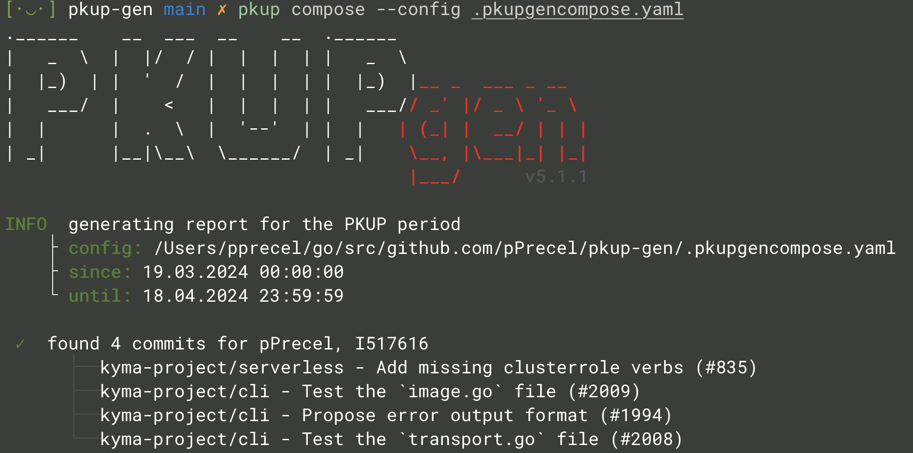
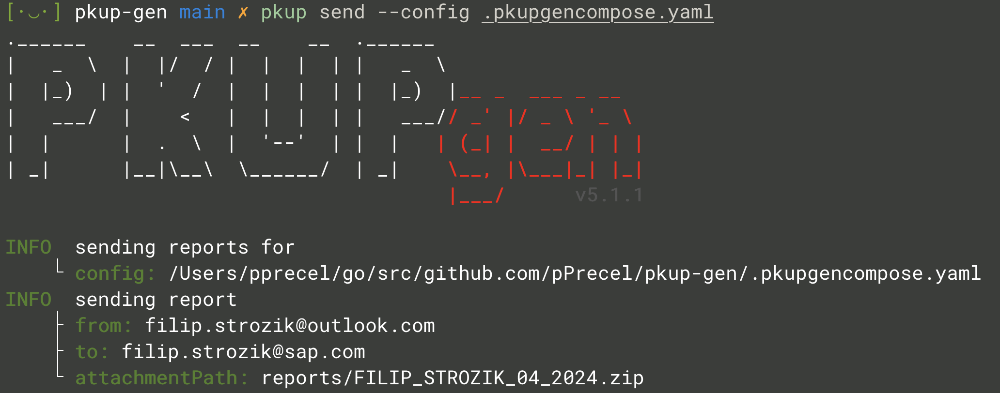

# Compose and Send

This scenario describes how to generate many reports for given repositories and organizations and send them to developers.

> NOTE: knowledge from the [simple-scenario](../simple-flow/README.md) and the [with-template](../with-template/README.md) may be useful to clarify some topics.

1. Create the `.pkupgencompose.yaml` file with the whole configuration ( config details [here](../../pkg/config/config.go) ):

    ```yaml
    reports:
    - outputDir: reports/FILIP_STROZIK
      email: "filip.strozik@outlook.com"
      signatures:
      - username: pPrecel
      - username: internalPrecel
        enterpriseUrl: "https://github.my-corp"
      reportFields:
        pkupGenEmployeesName: "Filip Strózik"
        pkupGenJobTitle: "Senior Developer"
        pkupGenDepartment: "R&D"
        pkupGenManagersName: "John Wick"
    # - outputDir: ...
    
    template: templates/report.docx

    orgs:
    - name: kyma-project
      token: ghp_5...C
    - name: kyma-incubator
      token: ghp_5...C
    - name: kyma
      token: ghp_1...G
      enterpriseUrl: "https://github.my-corp"
    
    repos:
    - name: kyma-project/busola
      token: ghp_5...C
      allBranches: true
      uniqueOnly: true
    - name: kyma-project/cli
      token: ghp_5...C
      branches: ["main", "v3"]
      uniqueOnly: true
    
    send:
      serverAddress: "smtp.gmail.com"
      serverPort: 587
      username: "pkup.gen@gmail.com"
      password: my_app_password
      subject: "PKUP report"
      htmlBodyPath: "templates/email_body_template.html"
      from: pkup.gen@gmail.com
    ```

  > **NOTE:** the `send` field supports only basic auth. This means that for more complex usecases use email-bridge (like [protonmail-bridge](https://proton.me/mail/bridge)) or choose an Gmail service provider that supports basic authentication. For example, gmail can be used but you have to generate an [app password](https://support.google.com/accounts/answer/185833?hl=en) first and be consistent with it's [limitations](https://support.google.com/a/answer/166852?hl=en).
  > **NOTE**: outlook get rid of support for basic auth for daemon applications ([read more](https://answers.microsoft.com/en-us/outlook_com/forum/all/getting-an-auth-error-i-need-help/b26708fd-14a9-41d5-902d-13a986e9c77c)).

2. Compose report ( example output ):

    

3. Send email ( example output ):

    
