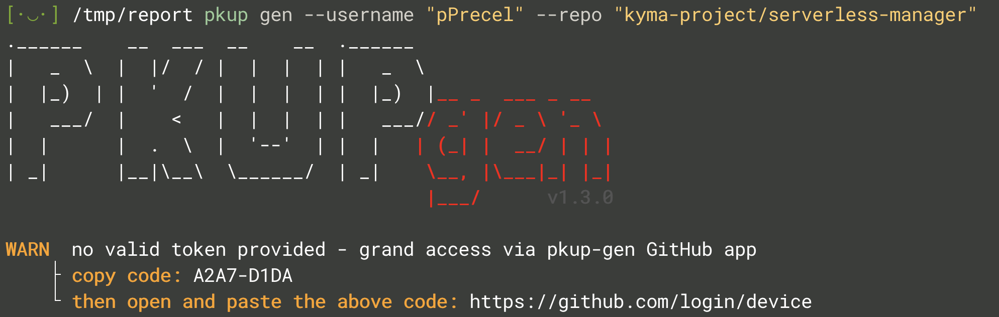
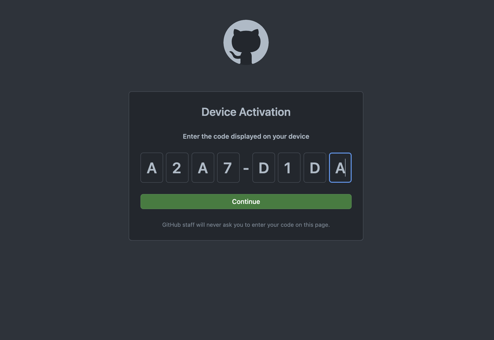
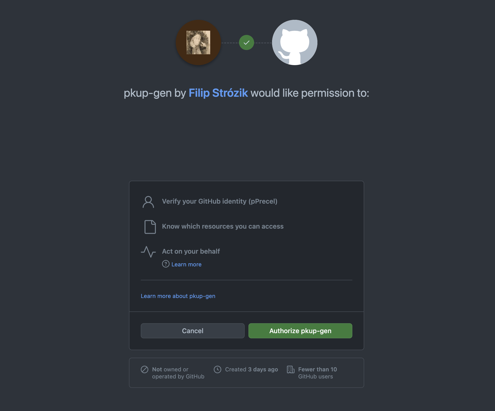
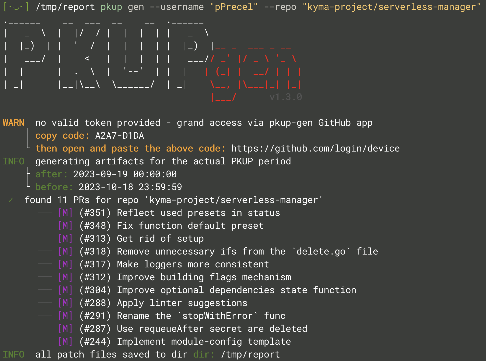
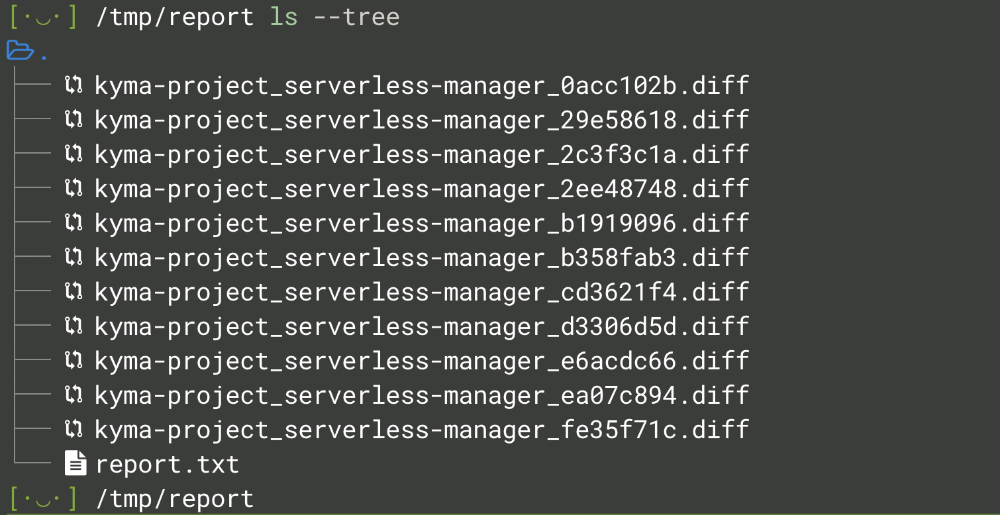
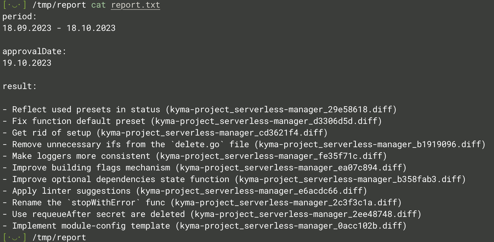

# Simple Flow

This scenario shows how to generate `.diff` files for a few repositories for the actual PKUP period in the acctual directory.

1. Construct `pkup-gen` spell with most basic flags:

    ```bash
    pkup gen --username "<GITHUB_USERNAME>" --repo "<ORG>/<REPO>"
    ```

    > Example: pkup gen --username "pPrecel" --repo "kyma-project/serverless-manager"

2. Because PAT token is not provided, `pkup-gen` try to connect to the GitHub app to create one - here follow the instructions in the `WARN` log:

    

3. On GitHub side you have to pass copied code and click `Continue` and then `Authorize pkup-gen`:

    
    

4. Now `pkup-gen` continues to generate artifacts what is represented in logs:

    

5. At the end you can see a few new files generated in the acctual directory and the `.txt` file with all info to manually fill `.docx` report:

    
    
