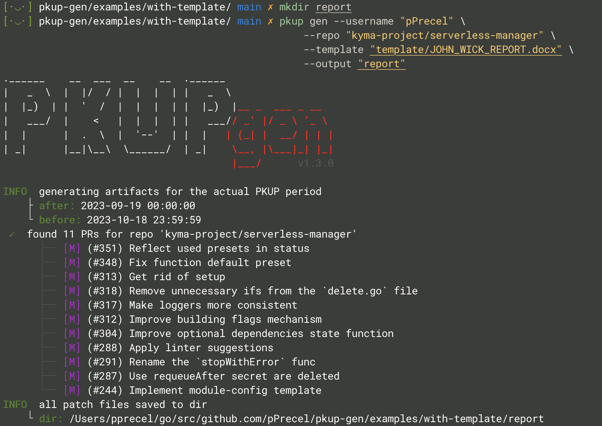
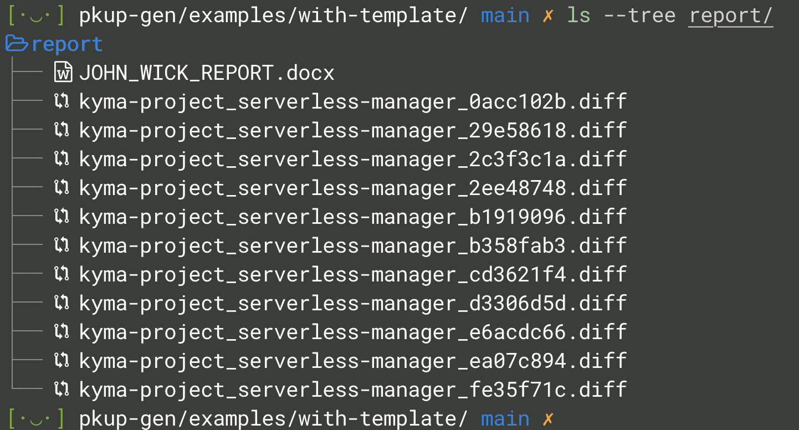
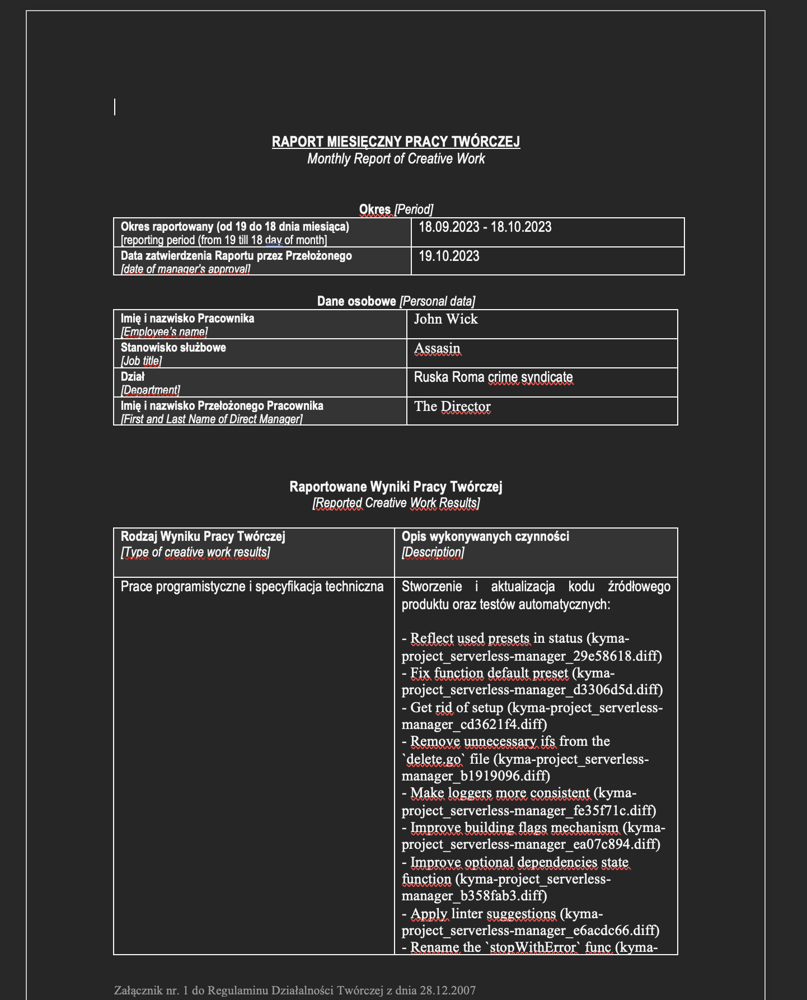
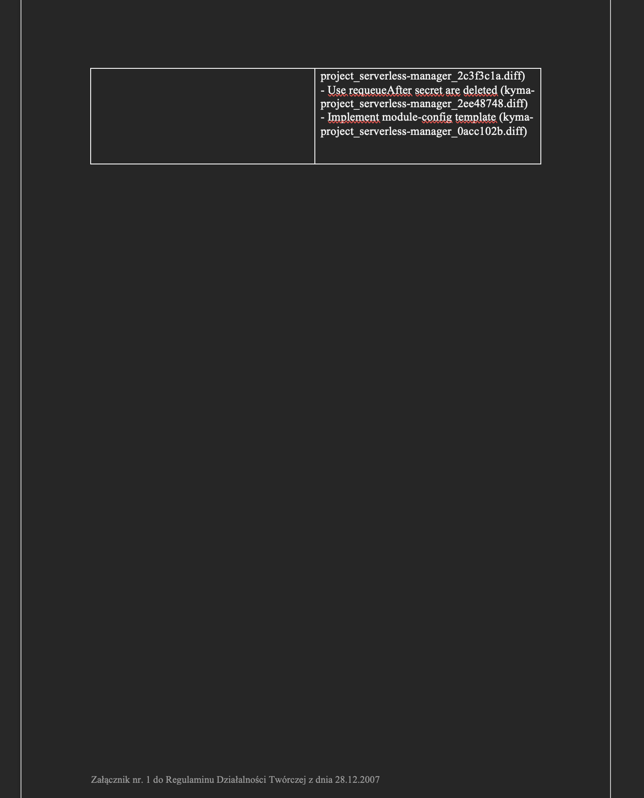

# With Template

In this example I would show you how easly generates `.docx` report based on the self-prepared `.docx` template.

> Note: I assume you have all important knowledge from the [simple-flow](../simple-flow/README.md) example.

1. Make output onstruct `pkup-gen` spell with most basic flags:

    ```bash
    mkdir report
    pkup gen --username "<GITHUB_USERNAME>" --repo "<ORG>/<REPO>" --template "<TEMPLATE_PATH>" --output "report"
    ```

    > Example: pkup gen --username "pPrecel" --repo "kyma-project/serverless-manager" --template "template/JOHN_WICK_REPORT.docx"

2. Now program generates output data.

    
    

3. The `pkup-gen` generated `.docx` report based on the tempalte with the same name. Note the app replaced a few key words in the templatet with true data (`pkupGenResults`, `pkupGenApprovalDate`, ...).

    
    
